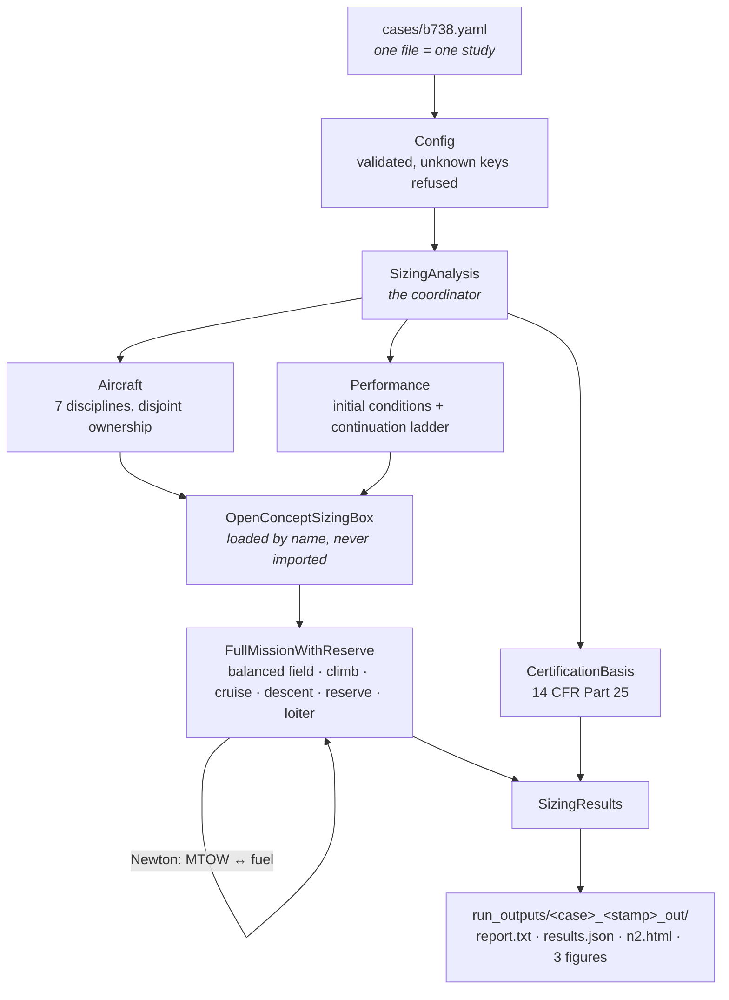
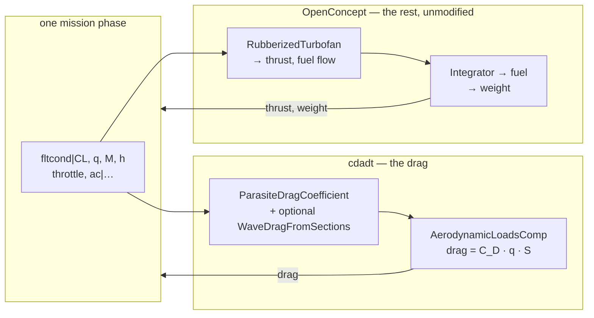
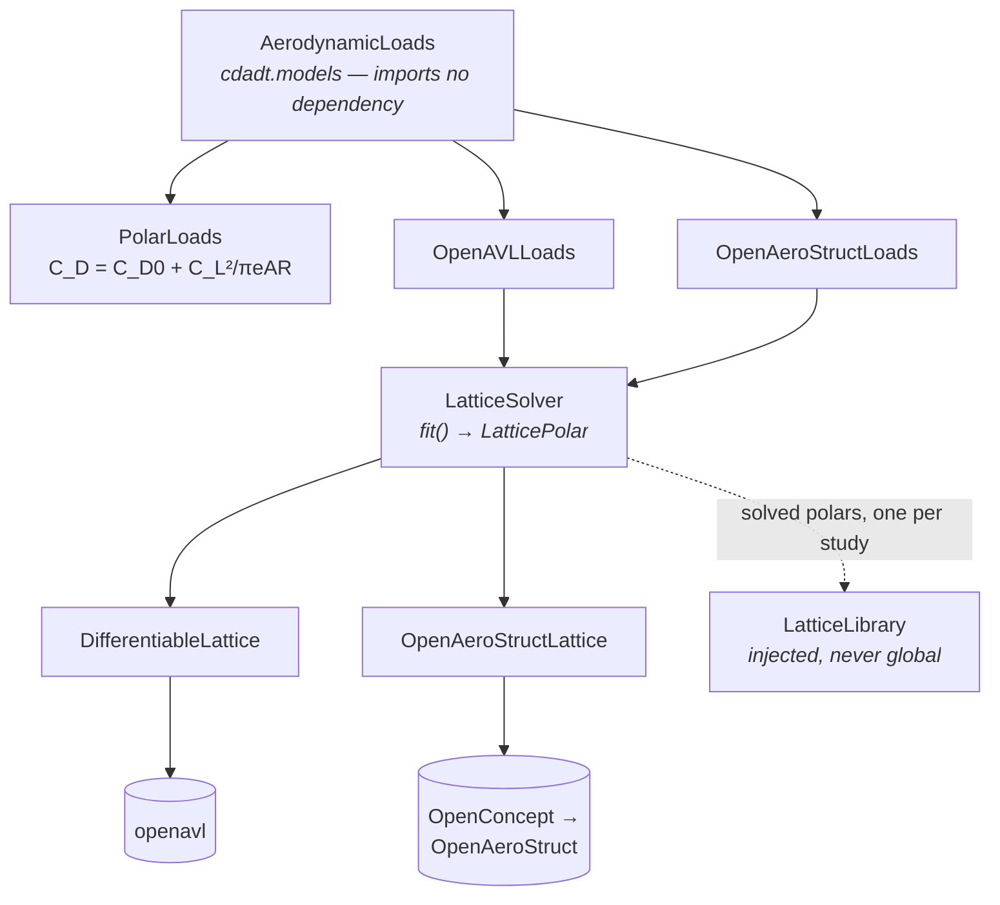
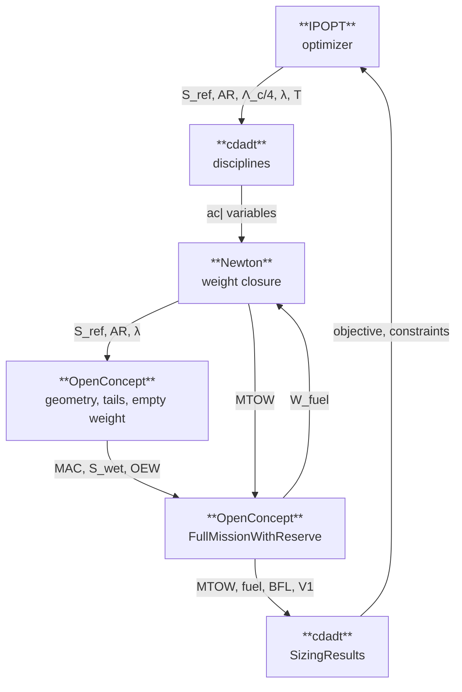
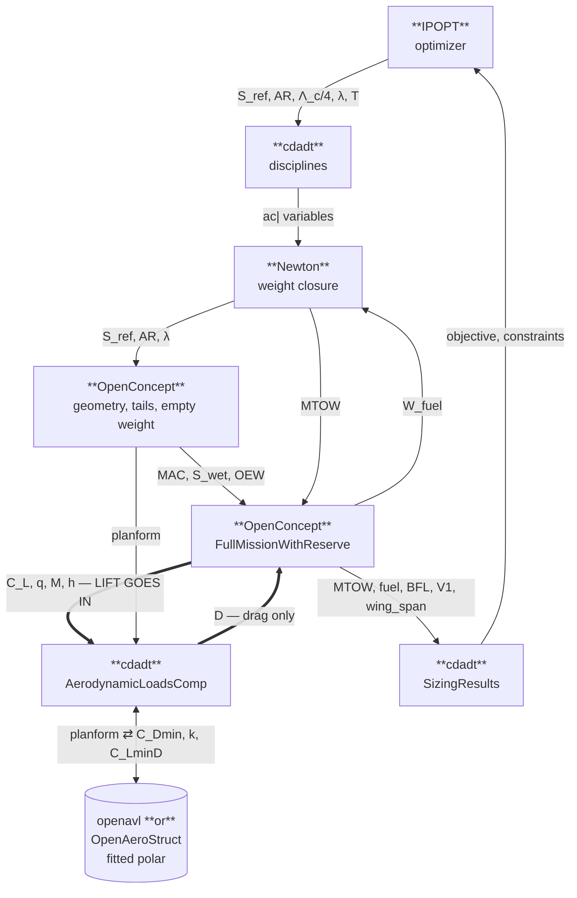

# cdadt

A certification-driven aircraft design tool.

cdadt sizes and optimizes an aircraft against an explicit certification basis. The sizing
itself — balanced-field takeoff, climb, cruise, descent, 14 CFR Part 25 reserves and loiter —
is performed by an [OpenConcept](https://github.com/mdolab/openconcept) analysis used as a
**black box**: cdadt sets its inputs, converges it, and reads its outputs.

The aerodynamics can be cdadt's own. A case file names a drag model, and three ship — a parabolic
polar, an [openavl](https://github.com/danielenriquez59/openavl) vortex lattice, and OpenConcept's
own OpenAeroStruct lattice — while the trajectory, balanced field, reserves, engine deck and weight
closure stay OpenConcept's, unmodified.

```bash
cdadt size     cases/b738.yaml                  # OpenConcept's own aerodynamics
cdadt size     cases/b738_avl.yaml              # an openavl vortex lattice
cdadt optimize cases/b738_oas_optimization.yaml # OpenConcept's own lattice, optimized
cdadt inspect  cases/b738.yaml
```

## Four claims, all enforced by the test suite

**OpenConcept is a black box, and exactly one package may open it.** The sizing analysis is named
in the case file as `module:ClassName` and loaded at run time. Sixteen contract tests hold the
boundary — OpenConcept is not subclassed, not modified, not **copied**, not **patched**, and not
imported anywhere outside `cdadt.adapter`, the one wrapper package. The copy and patch checks
matter because they are the ways of taking a dependency's behaviour the others would not notice: a
copy has no import to find and leaves the clone spotless, and a patch leaves both sources
untouched. Others hold the rest: `cdadt.models`, where cdadt's own physics lives, imports no
dependency at all, so a model stays testable without them; OpenAeroStruct is reached only *through*
OpenConcept and may not be imported by any cdadt module, adapter included; and each of the three
clones is separately checked to carry no uncommitted change.

**The aerodynamics is substitutable, and checkable against the codes it drives.** Two of the three
models are independent vortex lattices solving the same wing — which is what turns "the lattice says
0.99" from a claim into a measurement: compared like for like they agree on induced drag to
**0.67%**. Geometry derivatives are exact, not approximated: `jax.jacrev` through openavl's own
differentiable rebuild, and OpenMDAO totals through OpenAeroStruct's, both agreeing with central
differences to 3e-7. `docs/truth.rst` maps every result to the dependency artefact that is its
truth, including the rows that are empty and why.

**Every discipline is a class.** Geometry, aerodynamics, propulsion, stability, structures,
weights and performance are classes with encapsulated state. Each owns exactly one slice of the
black box's interface — which variables its domain sets, which responses its domain reports —
and ownership is checked to be total and disjoint against the *live* model, all 241 settable
variables of it. No global state, no module-level cache, no free function doing discipline work.

**A study is a file.** Every design variable, everything written into the box before it is
converged, the continuation ladder, the driver, the objective and the certification constraints
are all declared in one YAML case file, laid out block for block like OpenConcept's own `B738.py`
run script. A variable becomes free for the optimizer by gaining an `optimize:` entry where it is
already declared, so two studies that ask different questions of the same aeroplane differ only
in data — and never disagree about a number.

## How a run flows



Every phase of the mission instantiates one **aircraft model**. That is the seam cdadt opens: the
drag becomes cdadt's, everything else stays OpenConcept's.



The loads model behind `AerodynamicLoadsComp` is named in the case file and knows nothing about
OpenMDAO, OpenConcept or the mission:



## XDSM: what feeds what

An [XDSM](https://mdolab.engin.umich.edu/wiki/xdsm-overview) shows components, execution order and
the variables passing between them. Three ship, one per set; `docs/xdsm.rst` renders all three and
`docs/xdsm/` holds the pyXDSM sources a thesis would `\input`.

**The aircraft configuration into OpenConcept's box** — five components, nine connections. The drag
polar is inside the mission; nothing of cdadt's is on that path.



**With a vortex lattice** — seven components, fourteen connections. Two blocks appear, and one
connection is the point of the whole layer:



The two lattice sets are **structurally identical** — same seven components, same fourteen
connections, `openavl` swapped for `OpenAeroStruct`. That the diagrams are the same shape is the
point of the abstraction, and it is what makes comparing the two codes meaningful.

Note the thick arrows. `C_L` goes **into** the aerodynamics and only `D` comes back, which is the
subject of the next section.

## Lift goes in, drag comes out

OpenConcept's mission is a **point-mass trajectory** — `alpha` appears **zero times** in its
`phases.py` and `profiles.py`. So lift is not an aerodynamic result; it is a kinematic requirement,
and the mission solves vertical equilibrium for it:

```
C_L = cos(γ) · g · W / (q · S_ref)
```

The aerodynamics is then asked the only question left: **what does that lift cost?** Feeding lift
*in* would over-determine the system — the mission states `C_L` from equilibrium, a lattice states
`C_L(α)` from the flow, and there is no free variable between them. The missing one is angle of
attack; adding it plus the residual `C_L_lattice(α) − C_L_required = 0` is what a **trim solve** is,
and it is the point at which the other five coefficients start to matter.

Both lattices are parameterised by α internally and the polar fit *inverts* that, producing
`C_D(C_L)`. That inversion is why cdadt's aerodynamics drops into a point-mass mission at all.

| | produced by `PolarLoads` | produced by the lattices | consumed by the mission |
|---|---|---|---|
| `CL` lift | echoed | echoed | **input, not output** |
| `CD` drag | yes | yes | **yes** → drag force |
| `CY` `Cl` `Cm` `Cn` | no | yes | no consumer yet |

`AeroCoefficients` carries all six on purpose: the interface is shaped for what a lattice *is*, not
for what today's black box wants, so a trim residual or a static-margin constraint is a new consumer
rather than a new interface.

## The black box is the only one it could have been

`B738SizingMissionAnalysis` is the **sole** analysis in OpenConcept's ~30,000 lines of source that combines
a balanced-field takeoff, Part 25 reserves, a closed weight loop and a scalable engine. Every
other example is fixed-weight, or lacks the takeoff, or lacks the reserves. That is a survey
result, not a preference — see `docs/openconcept.rst`.

## Your own aerodynamics, inside their mission

The drag can be cdadt's. `cases/b738_avl.yaml` flies the same aeroplane and the same mission with a
vortex lattice built on its wing, while the trajectory, balanced field, reserves, engine deck and
weight closure stay OpenConcept's. **Two lattices are available behind one interface** — openavl,
and OpenConcept's own OpenAeroStruct — so the aerodynamics can be checked against an independent
code rather than taken on one solver's word. Switching is one line.

| case | aerodynamics | wave drag | for |
|---|---|---|---|
| `b738.yaml` | OpenConcept's own | none possible | the reference |
| `b738_avl.yaml` | openavl | on | induced drag from the wing's shape |
| `b738_oas.yaml` | OpenAeroStruct | on | the same, through OpenConcept's own lattice |

Each has an `_optimization` twin: `b738_optimization.yaml`, `b738_avl_optimization.yaml` and
`b738_oas_optimization.yaml`. Three sets of two — the aircraft configuration into the black box,
and the same configuration with each of the two vortex lattices supplying the aerodynamic loads.

The parity anchor is not a case file. `tests/test_adapter.py` builds it from `b738.yaml` at run
time, swapping in cdadt's analysis group with the parabolic polar, and asserts it reproduces the
reference to 4e-13. Keeping it in the suite rather than in `cases/` puts it where it is actually
checked, instead of relying on someone running it.

```yaml
black_box:
  model: cdadt.adapter.analysis:SizingMissionAnalysis
  options:
    aerodynamic_loads: cdadt.adapter.avl:OpenAVLLoads
    #                  cdadt.adapter.oas:OpenAeroStructLoads
    #                  cdadt.models.polar:PolarLoads
```

With the parabolic polar — the same equation OpenConcept evaluates — this path reproduces
`run_738_sizing_analysis` to **4e-13**, which is what proves the machinery before new physics
rides on it. With the lattice, which reports a span efficiency of 0.990 against the 0.82 the case
file assumes, fuel with reserves falls **6.4%** against the reference. Read that figure carefully:
it nets two effects with opposite signs, because the reference has no transonic drag rise and cannot
be given any. Flying the parabolic polar *with* drag rise separates them — the drag rise costs
**+1.8%**, and the lattice alone is worth **−8.1%**. That is one line of a case file away
(`aerodynamic_loads: cdadt.models.polar:PolarLoads` with `wave_drag: true`) and worth doing before
quoting either number on its own. Its geometry derivatives
are exact — `jax.jacrev` through openavl's own differentiable lattice, not a formula about it.
Transonic drag rise is available too, from OpenConcept's own Korn-equation model, off by default so
the reference example stays reproducible.

Every one of those numbers is anchored to something a dependency publishes rather than to cdadt's
own consistency: **0.67%** against OpenConcept's own vortex lattice on the same wing, **1.3e-6**
against the literals OpenConcept's test suite defends, and **1.6e-15** on the identity that ties the
fitted polar to openavl's own span efficiency. `docs/truth.rst` is the map of what is checked
against what — including the rows that are empty, and why. Read `docs/aerodynamics.rst` for what the
lattice result is and is not evidence of; it is the optimistic end of a range, and the range is
measured.

## Verified: the equations are solved right

| Study | Result |
|---|---|
| **Grid convergence** | Observed order **4.7** (Simpson's rule is 4th order); shipped 21-node grid converged to **1e-6** |
| **Total derivatives** | Agree with finite differences to **1.1e-4**, with the textbook truncation/round-off minimum at step 1e-6 |
| **Solver tolerance** | Every tolerance probed down to **1e-12** is reachable on every grid, so the shipped 1e-9 has three decades of margin |
| **Reproducibility** | Three different continuation ladders reach the same aircraft to **1e-7**; reruns are bit-identical |
| **Environment** | Rebuilt from scratch out of `environment.yml` **including the optional extras**; all 384 tests pass in it and every number reproduces |
| **Optimality** | No feasible ±2% perturbation of any design variable improves the objective |
| **Coverage** | **100%** of statements and branches, enforced; no exclusion list, and the two `# pragma: no cover` lines are named in `docs/verification.rst` |

Details and the full tables in `docs/verification.rst`.

## Validated against the reference, run rather than quoted

`tests/test_validation.py` imports OpenConcept's own `run_738_sizing_analysis`, runs it in the
same process at the same grid, and compares every quantity at 1e-6 relative — the Newton
solver's own convergence, not an engineering tolerance.

| Quantity | Value |
|---|---|
| Maximum takeoff weight | 78,345.6435 kg |
| Operating empty weight | 41,748.3258 kg |
| Block fuel | 15,977.0628 kg |
| Fuel with reserves | 18,597.3177 kg |
| Balanced field length | 5,247.7948 ft |
| Horizontal tail area | 27.9332 m² |
| Vertical tail area | 20.2101 m² |

And validated against the real aeroplane, independently of OpenConcept: MTOW within **0.8%** and
OEW within **0.8%** of published 737-800 figures, with cruise L/D 17.5, TSFC 0.614 lb/lbf/hr,
wing loading 629 kg/m² and thrust-to-weight 0.313 — every dimensionless group inside the band a
narrow-body transport occupies.

## Optimized against a certification basis

Minimizing fuel with reserves over the wing planform and the engine rating, subject to 14 CFR
25.113, 25.121(b)(1)(i) and the engine deck's throttle band:

| Quantity | Baseline | Optimum | Change |
|---|---|---|---|
| Fuel with reserves (kg) | 18,596.8 | 16,399.6 | **−11.8%** |
| Maximum takeoff weight (kg) | 78,345.0 | 72,324.2 | −7.7% |
| Engine rating (lbf) | 27,000 | 21,357.8 | −20.9% |

Four of four constraints met, one active — the climb throttle band. Neither certification
constraint binds. Three of the five design variables end on a bound, which is the bounds doing the
modelling and is called out as such in `docs/optimization.rst`.

An earlier version of this study reported −14.4%, from bounds that let the optimizer reach a wing
loading of 759 kg/m² — outside the range the box's weight correlations were fitted over, and a
region where its solver does not converge. A better answer, obtained somewhere the model is not
valid.

### The same study, on each aerodynamics

| | reference | openavl | OpenAeroStruct |
|---|---|---|---|
| Fuel with reserves (kg) | 16,399.6 | 15,314.9 | 15,066.7 |
| against its own baseline | −11.8% | −12.0% | −12.3% |
| Engine rating (lbf) | 21,357.8 | 19,985.5 | 19,677.1 |
| **Quarter-chord sweep (deg)** | **15.0 — lower bound** | **31.41** | **31.56** |
| Taper ratio | 0.1345 | 0.1598 | 0.2358 |
| Wing span (m) | not published | 35.50 | 35.50 |
| Constraints | 4/4 met | 5/5 met | 5/5 met |

**Sweep is the interesting row, and it is not the lattice's doing.** The reference drives it to the
lower bound because in that model sweep can only cost — it adds structural weight and buys nothing,
since OpenConcept's B738 group has no transonic drag rise and cannot be given any. With drag rise
modelled, sweep goes the other way and stops *short* of its 32° bound: an interior optimum, which is
what a correctly posed trade looks like.

Attributing that to the vortex lattice would be wrong. Flying the *parabolic polar* with wave drag
on puts sweep at 31.1° too — it is driven by the drag-rise model, which depends on sweep whatever
computes the induced drag. The lattices contribute the fuel, not the sweep.

The two independent codes land within **0.15°** on sweep and **1.6%** on fuel. They disagree most on
taper, which is where a near-field induced drag and a Trefftz-plane one differ most; `docs/truth.rst`
gives the measured size of that rather than averaging it away.

```
regulation              constraint                                             value        bound      margin  units  status
---------------------------------------------------------------------------------------------------------------------------
14 CFR 25.113           Balanced field length within the runway available  6587.1294      <= 8000  1412.8706   ft     MET
14 CFR 25.121(b)(1)(i)  OEI second-segment climb gradient                     0.0501     >= 0.024     0.0261   rad    MET
-                       Climb throttle within the engine deck                 1.0500 0.01 to 1.05     0.0000   -      ACTIVE
-                       Cruise throttle within the engine deck                0.8691 0.01 to 1.05     0.1809   -      MET

Design constraints with no stated regulation or source: climb_throttle, cruise_throttle.
These bound the design; they are not certification evidence.
```

**Read `docs/validation.rst` before quoting any of this.** It states what has been established
and, at least as prominently, what has not — including that §25.121(b) is evaluated clean rather
than in the takeoff configuration the regulation specifies, that there is no V<sub>MC</sub>, no
approach speed and no CG model, and which OpenConcept commit these numbers correspond to.

The installed clone is exactly upstream `mdolab/openconcept`. Nothing in this repository modifies OpenConcept, and nothing is ever pushed to it. The installed
clone is checked for uncommitted changes by the test suite, and any commit it carries that
upstream does not is checked against the modules cdadt actually loads.

## Install

```bash
conda create -y -n cdadt_env -c conda-forge python=3.11 "numpy<2" scipy matplotlib pyyaml \
    openmdao pyoptsparse ipopt cyipopt pytest pytest-cov sphinx sphinx_rtd_theme ruff black
conda install -y -n cdadt_env -c conda-forge "libblas=*=*openblas"
conda activate cdadt_env

pip install -e /path/to/openconcept --no-deps   # --no-deps is required; see docs/install.rst
pip install -e ".[dev,docs]"
```

The OpenBLAS pin is not optional on Windows: with MKL-backed BLAS, NumPy aborts the interpreter
(`0xc06d007f`) inside `numpy.linalg.solve`, which OpenConcept calls at import.

## Run

```bash
cdadt size cases/b738.yaml                        # ~5 s at 21 nodes per phase
cdadt optimize cases/b738_optimization.yaml       # ~2 min
cdadt inspect cases/b738.yaml --what inputs       # what the box accepts

# every run writes run_outputs/<case>_<stamp>_out/ with the report, the numbers,
# the N2, three figures, OpenMDAO's own reports and the optimizer's log

pytest -q -m "not slow"                           # the fast loop, 320 tests, ~3 min
pytest -q                                         # 384 tests, ~25 min
pytest -q --cov=cdadt                             # and 100% statement + branch coverage
pytest -q -m verification                         # grid, derivatives, solver, reproducibility
pytest -q -m validation                           # reference match + physical checks
cd docs && make html
```

Tests are marked by the class of claim they make — `unit` (143), `contract` (14),
`integration` (35), `verification` (39), `validation` (19) — so "the suite passes" is a
statement about what has been established, not one undifferentiated green tick.

Coverage is **100% of statements and branches**, enforced by `fail_under = 100`, with no
exclusion list. That is a fair target here only because cdadt computes no physics: everything in
it is interface, routing, validation and reporting, so an unreachable line is dead code or a
missing test.

## Layout

```
cdadt/
  parameters.py     Parameter, Response — the two value objects
  disciplines/      one class per engineering domain, each owning its slice of the interface
  aircraft.py       Aircraft — composes the disciplines, routes every ac| name to one owner
  mission.py        InitialConditions, ContinuationLadder, ContinuationStep
  blackbox.py       OpenConceptSizingBox — loaded by name, set, converged, read
  config.py         the case file, validated hard
  analysis.py       SizingAnalysis — build, converge, read
  results.py        ResponseCatalog, SizingResults
  certification.py  Constraint, ConstraintResult, CertificationBasis, the traceability matrix
  optimization.py   Optimizer, OptimizationOutcome
  artifacts.py      StudyArtifacts, MissionTrajectory — the N2, the trajectory plot, the report
  cli.py            cdadt size | optimize | inspect
cases/              b738.yaml, b738_optimization.yaml
examples/           size_b738.py, optimize_b738.py
tests/              unit / contract / integration / validation
docs/               Sphinx
```

## Documentation

| Page | Contents |
|---|---|
| `install.rst` | Environment setup, and why each flag is required |
| `quickstart.rst` | The three commands and what they print |
| `tutorials.rst` | Change the aircraft, the mission, the question; free a variable, add a constraint or a discipline |
| `architecture.rst` | The classes, what each owns, and the tests that enforce the rules |
| `blackbox.rst` | Exactly what "black box" means, what goes in, what comes out, what is fixed inside |
| `configuration.rst` | Every key of the case file |
| `mission.rst` | The initial conditions, and why the continuation ladder is part of the interface |
| `aerodynamics.rst` | Supplying your own aerodynamics, and the openavl vortex-lattice model |
| `certification.rst` | Constraints, provenance, the traceability matrix, what cannot be constrained |
| `optimization.rst` | Design variables, scaling, driver choice, and why IPOPT |
| `artifacts.rst` | What every run writes into `run_outputs/`, and what is plotted |
| `verification.rst` | Grid convergence, derivative accuracy, solver tolerance, reproducibility, optimality |
| `validation.rst` | What is validated, against what, **and what is not** |
| `openconcept.rst` | The survey of all ~30,000 lines, and why this black box is the only candidate |
| `interface.rst` | The generated input/output reference |
| `developing.rst` | The working guide: the loop, the gates a change must pass, where each kind of change belongs |

## License

MIT. See `LICENSE`.
