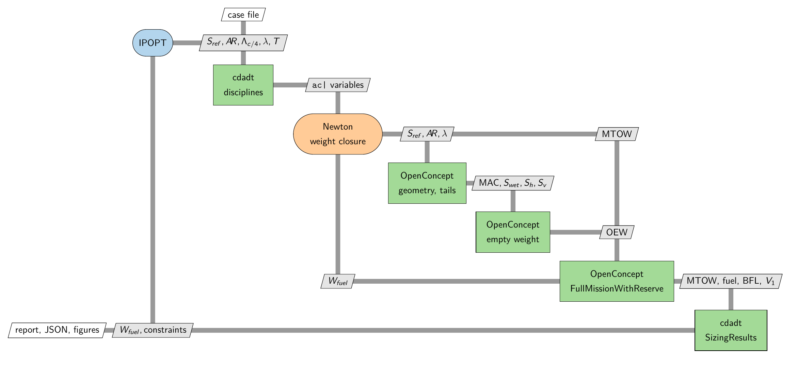
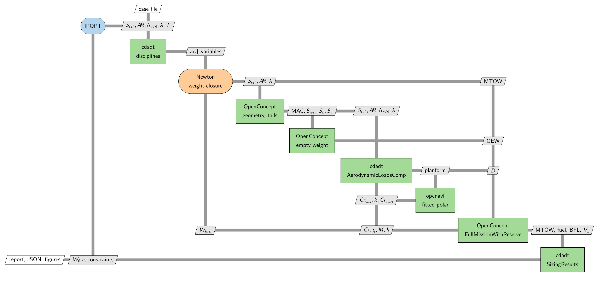
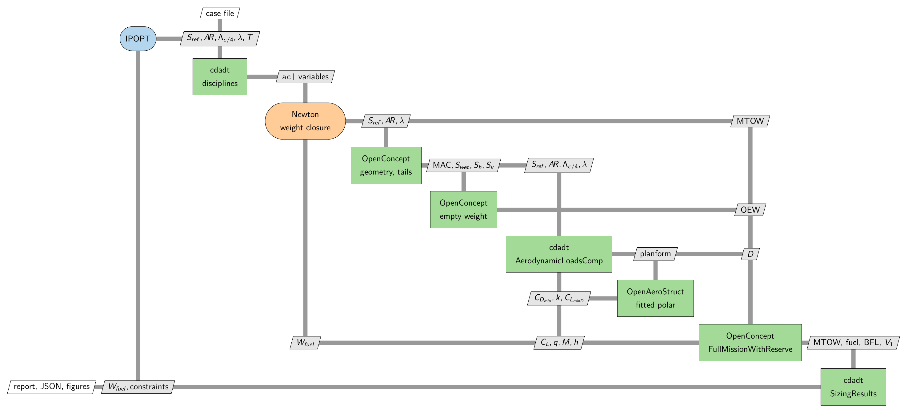

XDSM: what feeds what
=====================

An XDSM -- an eXtended Design Structure Matrix, in the sense of Lambe and Martins (2012) -- says two
things at once that a block diagram cannot. The **diagonal** is the components and the order they
execute in; the **off-diagonal** cells are the data passing between them. A cell above the diagonal
flows forward, a cell below it is feedback.

That second half is why these are worth having. The whole shape of cdadt's aerodynamics layer is
that the mission hands the lift coefficient *in* and takes drag *out*, and no amount of prose makes
that as plain as seeing :math:`C_L` in a cell pointing at the loads model rather than away from it.

Three sets ship, and the diagrams differ in exactly one place. Read them in order.

.. contents::
   :local:
   :depth: 1

The aircraft configuration into OpenConcept's box
--------------------------------------------------

``cases/b738.yaml`` and ``cases/b738_optimization.yaml``. Every drag number is OpenConcept's, and
cdadt never touches the aerodynamics.

.. code-block:: text

   case file
       |
       v
   +==========+  x* = S_ref, AR, Lc/4, taper, T
   | OPTIMIZER|--------+
   |  IPOPT   |        |                                                  <-- W_fuel, constraints
   +==========+        v
                   +==========+
                   |  cdadt   |  ac| variables
                   |disciplines|------+
                   +==========+       |
                                      v
                                  +==========+                    W_fuel (feedback)
                                  |  NEWTON  |<--------------------------------+
                                  | weights  |  S_ref, AR, taper               |
                                  +==========+------+          MTOW            |
                                                    v            |             |
                                             +============+      |             |
                                             |OpenConcept |      |             |
                                             | geometry,  |      |             |
                                             | tails,     |      |             |
                                             | empty wt   | OEW  |             |
                                             +============+--+   |             |
                                                               v v             |
                                                        +===============+      |
                                                        |  OpenConcept  |      |
                                                        |FullMissionWith|------+
                                                        |    Reserve    |
                                                        +===============+
                                                                | MTOW, fuel, BFL, V1
                                                                v
                                                        +===============+
   report, JSON, figures  <-----------------------------|cdadt SizingRes|
                                                        +===============+

Five components, nine data connections. The drag polar lives inside
``FullMissionWithReserve``; there is nothing of cdadt's on that path to draw.

With an openavl vortex lattice
-------------------------------

``cases/b738_avl.yaml`` and ``cases/b738_avl_optimization.yaml``. Two components appear that were
not there before, and one connection is the point of the whole layer.

.. code-block:: text

   +==========+  x* = S_ref, AR, Lc/4, taper, T
   | OPTIMIZER|--------+                                            <-- W_fuel, constraints
   +==========+        v
                   +==========+
                   |  cdadt   | ac| variables
                   |disciplines|-----+
                   +==========+      v
                                 +==========+                        W_fuel (feedback)
                                 |  NEWTON  |<-------------------------------------+
                                 | weights  |--+ S_ref, AR, taper                  |
                                 +==========+  |               MTOW                |
                                               v                 |                 |
                                        +============+           |                 |
                                        |OpenConcept |           |                 |
                                        | geometry,  |-----------+                 |
                                        | empty wt   | OEW,      |                 |
                                        +============+ MAC       | planform        |
                                               |                 v                 |
                                               |          +===============+        |
                                               +--------->|    cdadt      |        |
                                                          | AerodynamicL- |        |
                                    C_L, q, M, h  +------>|   oadsComp    |        |
                                    (LIFT GOES IN)|       +===============+        |
                                                  |          |        ^            |
                                                  |  planform|        | CDmin,     |
                                                  |          v        | k, CLminD  |
                                                  |     +===============+          |
                                                  |     |    openavl    |          |
                                                  |     | fitted polar  |          |
                                                  |     +===============+          |
                                                  |          |                     |
                                                  |          | D (drag only)       |
                                                  |          v                     |
                                             +===============+                     |
                                             |  OpenConcept  |---------------------+
                                             |FullMissionWith|
                                             |    Reserve    |
                                             +===============+
                                                     | MTOW, fuel, BFL, V1, wing_span
                                                     v
                                             +===============+
   report, JSON, figures  <------------------|cdadt SizingRes|
                                             +===============+

Seven components, fourteen connections. **Look at the arrow marked LIFT GOES IN.** The mission
supplies :math:`C_L`, dynamic pressure, Mach and altitude to the loads model, and only :math:`D`
comes back. The lift is not an aerodynamic result -- it is a kinematic requirement the trajectory
has already solved from vertical equilibrium, and the aerodynamics is being asked what it costs.
:doc:`aerodynamics` works through why, and what would have to change for lift to be an input.

Two further things the diagram shows:

The lattice sits **behind** the loads component rather than beside it, exchanging a planform for
three polar coefficients. That is what makes a mission of 170 analysis points affordable: the
lattice is solved once per geometry, not once per node.

``wing_span`` appears in the output edge here and not in the baseline, because cdadt's analysis
group composes OpenConcept's ``WingSpan`` and OpenConcept's own group does not.

With OpenConcept's OpenAeroStruct lattice
------------------------------------------

``cases/b738_oas.yaml`` and ``cases/b738_oas_optimization.yaml``. **Structurally identical to the
figure above** -- same seven components, same fourteen connections -- with ``openavl`` replaced by
``OpenAeroStruct``, reached through OpenConcept's own ``VLM`` rather than directly.

That the two diagrams are the same shape is the point of the abstraction, and it is what makes the
comparison in :doc:`truth` meaningful: two independent codes, one interface, one difference.

Regenerating them
------------------

The figures above are pyXDSM output; the ASCII beside each is the same topology for anyone reading
the source rather than the built page. ``docs/xdsm/`` also holds the ``.tex``, which is what a thesis
would ``\input``:

.. code-block:: bash

   python docs/xdsm/build_xdsm.py

Two things about that script are deliberate. It reads ``cases/`` to build each figure's caption --
the analysis group, the loads model, whether wave drag is on -- so a diagram cannot come to describe
a configuration that no longer ships, even though its topology is authored by hand. And it degrades
honestly: pyXDSM emits TikZ and needs a LaTeX engine, so the build uses ``pdflatex`` where a TeX
installation exists and ``tectonic`` otherwise, then rasterises with ``pdftoppm``. Whatever is
missing is skipped and said aloud, and a stale image is deleted rather than left looking current.

Neither belongs in the analysis environment -- installing a TeX engine beside a pinned numpy stack
risks the stack to draw a picture -- so keep them apart and the build will find them::

    pip install -e ".[xdsm]"                                   # pyXDSM itself
    conda create -n xdsm_render -c conda-forge tectonic poppler  # the renderers

The ``.png`` is committed because the documentation displays it. The ``.pdf`` is not: it regenerates
from the ``.tex`` in one command and is only wanted for print.
